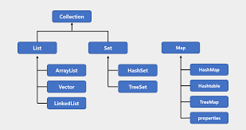

# Collection Framework
컬렉션은 다수의 요소들을 하나의 그룹으로 묶어 저장하고 관리하는 기능을 제공하는 자바의 기능이다.      


크게 List, Queue, Map로 나뉜다.

### ArrayList
동적배열이다.     
```List.of()```를 사용하면 선언과 동시에 초기화 할 수 있다.
```java
List<String> arr = new ArrayList<String>();
List<String> list = new ArrayList<String>(List.of("aaa", "bbb", "ccc"));

arr.add("ppap");
arr.add("aaa");
arr.remove(0);
arr.remove("aaa");

list.get(1);
list.size()
```

## Set
리스트와 다르게 인덱스로 저장하지 않는다. 동일한 객체는 저장하지 않는다.
```java
Set<String> set = new HashSet<>();

set.add("aaa");
set.add("bbb");
set.remove("aaa");

set.size();

for (String i : set) {    // 요소들 출력
    System.out.println(i);
}

```

## Map
```Key : Value```형식으로 구성되어있다. 키와 값 각각은 객체이고 Key는 중복이 불가능하다.    
```java
Map<String, Integer> map = new HashMap<String, Integer>();

map.put("a":1);
map.put("b", 1);

map.size();
map.get("a");
map.keySet();
```